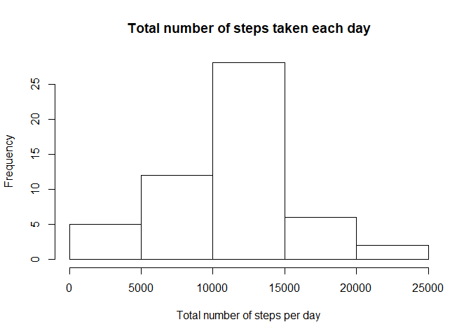
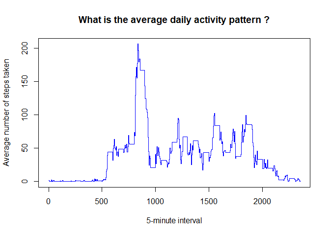
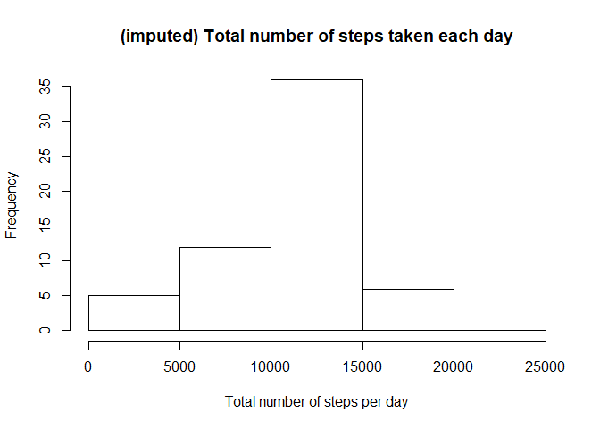
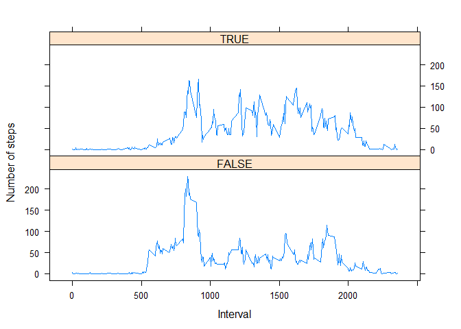

## Loading and preprocessing the data
1. Unzip and load the data with read.csv


```r
setwd("~/GitHub/RepData_PeerAssessment1")
unzip("activity.zip")
activity <- read.csv("activity.csv", header = TRUE, sep = ",", na.strings = "NA")
```
2. Process / transform the data into a format suitable for analysis
=> not required

## What is mean total number of steps taken per day ?
(for this part of the assignment, I can ignore the missing values in the dataset)

```r
# calculate total number of steps per day
totalStepsByDay <- aggregate(activity$steps ~ activity$date, activity, sum)
```
1. Make a histogram of the total number fo steps taken each day:

```r
hist(totalStepsByDay$`activity$steps`,
     xlab="Total number of steps per day",
     main="Total number of steps taken each day"
)
```

<!-- -->

2. Calculate and report the **mean** and **median** total number of steps taken per day

```r
stepsByDayMean <- mean(totalStepsByDay$`activity$steps`)
stepsByDayMedian <- median(totalStepsByDay$`activity$steps`)
```
The **mean** is **1.0766189\times 10^{4}** and the **median** is **10765**

## What is the average daily activity pattern ?
1. make a time series plot of the 5-minute interval (x-axis) and the average number of steps taken, averaged across all days (y-axis)

```r
interval_avgSteps <- aggregate(steps ~ interval, activity, mean)
plot(interval_avgSteps$interval, interval_avgSteps$steps, type='s', col="blue", 
     main="What is the average daily activity pattern ?", xlab="5-minute interval", 
     ylab="Average number of steps taken")
```

<!-- -->

2. Which 5-minute interval, on average across all the days in the dataset, contains the maximum number of steps ?

```r
# get the interval with maximum average number of steps in an interval
max_interval <- interval_avgSteps [which.max(interval_avgSteps$steps), ]
```

The interval **835** has the maximum average numver of steps **206.1698113**

## Imputing missing values
Note that there are a number of days/intervals where there are missing values (coded as NA). The presence of missing days may introduce bias into some calculations or summaries of the data.
1. Calculate and report the total number of missing values in the dataset (i.e. the total number of rows with NAs)

```r
activity_NArows <- NROW(activity[is.na(activity)])
```
The number of rows with NA is **2304**.

2. Devise a strategy for filling in all of the missing values in the dataset. The strategy does not need to be sophisticated. For example, you could use the mean/median for that day, or the mean for that 5-minute interval, etc.
*I will use mean for that 5-minute interval for NA entries. This will be achieved with **for** statement going through all lines of data frame "activity"*

3.	Create a new dataset that is equal to the original dataset but with the missing data filled in.

```r
# calculate mean values per interval across all days
intervalMeanSteps <- aggregate(activity$steps ~ activity$interval, activity, mean)
for (i in 1:nrow(activity))
  if (is.na(activity$steps[i]))
    for (j in 1:nrow(intervalMeanSteps))
      if (intervalMeanSteps$`activity$interval`[j] == activity$interval[i])
        activity$steps[i] <- intervalMeanSteps$`activity$steps`[j]
```
4. Make a histogram of the total number of steps taken each day and Calculate and report the mean and median total number of steps taken per day. Do these values differ from the estimates from the first part of the assignment? What is the impact of imputing missing data on the estimates of the total daily number of steps?

```r
imputedTotalStepsByDay <- aggregate(activity$steps ~ activity$date, activity, sum)
hist(imputedTotalStepsByDay$`activity$steps`,
     xlab="Total number of steps per day",
     main="(imputed) Total number of steps taken each day"
)
```

<!-- -->

## Are there differences in activity patterns between weekdays and weekends?
For this part the weekdays() function may be of some help here. Use the dataset with the filled-in missing values for this part.
1. Create a new factor variable in the dataset with two levels - "weekday" and "weekend" indicating whether a given date is a weekday or weekend day.

```r
activity$weekend <-chron::is.weekend(activity$date)
stepsByDay <- aggregate(steps ~ interval + weekend, data = activity, mean)
```
2. Make a panel plot containing a time series plot (i.e. type = "l") of the 5-minute interval (x-axis) and the average number of steps taken, averaged across all weekday days or weekend days (y-axis). The plot should look something like the following, which was created using simulated data:

```r
library(lattice)
xyplot(steps ~ interval | weekend, 
       stepsByDay, type = "l", layout = c(1, 2),
       xlab = "Interval", ylab = "Number of steps")
```

<!-- -->
